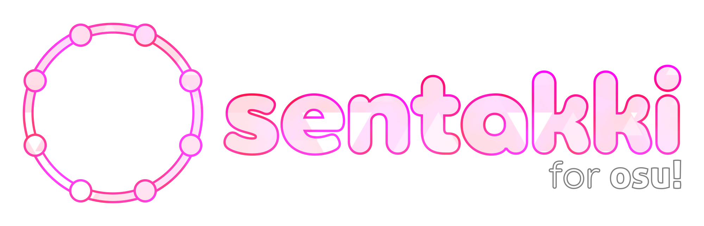

# sentakki

[](https://github.com/LumpBloom7/sentakki/actions?query=workflow%3A%22.NET+Core%22) [](https://www.codefactor.io/repository/github/lumpbloom7/sentakki) [](https://discord.gg/CQPNADu)

An attempt to recreate Sega's maimai within osu!lazer, while making it more flexible.

## Status

This is very much a WIP. Most of maimai's note types are yet to be implemented, and most lazer features are also absent. However, I do consider it playable, albeit in a limited fashion.

### End goal

It should be on par or even better than what Sega has provided with their cabinets. It should also have a level of quality that rivals official osu! rulesets.

## Trying the ruleset

Prebuilt binaries are provided for users who doesn't want to create a development environment.. Releases are guaranteed to work with the latest version of lazer at the time of release.

| [Releases](https://github.com/lumpbloom7/sentakki/releases/) |
| ---- |

This is a lazer exclusive ruleset, don't expect it to work on stable.

## Debugging and Developing

Some prerequisites are required before attempting to debug or develop:

* A desktop platform with the .NET Core 3.1 SDK or higher installed.
* An IDE with support for C#, providing auto completion and syntax highlighting. I recommend using Visual Studio 2019 or Visual Studio Code.
* Other requirements are shared with osu!lazer and osu!framework

### Downloading the source code

Clone the repository:

```sh
git clone https://github.com/lumpbloom7/sentakki
cd sentakki
```

To update the source code to the latest commit, run the following command inside the osu directory:

```she
git pull
```

### Building

Using the `Build` command from your IDE should generate a DLL file within the output directory. If you're debugging or developing, it is a bit more convenient to run the `VisualTests` project instead since that'll remove the need to copy the dll to your lazer directory.

You can also build maimai for osu! from the command-line with a single command:

```sh
dotnet build osu.Game.Rulesets.Sentakki
```

## Contributing

I welcome any sort of contributions, as long as they are helpful. Those who aren't able to develop may instead suggest changes or report issues via [GitHub issues](https://github.com/lumpbloom7/sentakki/issues)

## Licence

Sentakki is licensed under the [MIT licence](https://opensource.org/licenses/MIT). Please see the licence file for more information. tl;dr you can do whatever you want as long as you include the original copyright and license notice in any copy of the software/source.

Do take note that project dependencies may not share the same license.
